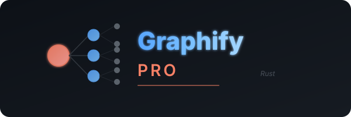

<p align="center">
  
</p>

<p align="center">
  <a href="https://github.com/codex0027/Graphify-Pro"></a>
  <a href="https://github.com/codex0027/Graphify-Pro"></a>
  <a href="https://github.com/codex0027/Graphify-Pro/blob/main/LICENSE"></a>
  <a href="https://github.com/codex0027/Graphify-Pro"></a>
  <a href="https://github.com/codex0027/Graphify-Pro"></a>
  <a href="https://github.com/codex0027/Graphify-Pro/actions"></a>
  <a href="https://github.com/codex0027/Graphify-Pro/wiki"></a>
</p>

---

**Graphify Pro** is a blazing-fast Rust reimagining of [Graphify](https://graphify.net) — a tool that maps your entire project (code, docs, PDFs, manifests) into a **knowledge graph** you can **query instead of grepping** through files.

- **Code maps for free, fully local.** Code is parsed with tree-sitter AST: deterministic, no LLM, nothing leaves your machine. (Docs and PDFs use optional LLM pass.)
- **Every edge is explained.** Each connection is tagged `EXTRACTED` (explicit in the source) or `INFERRED` (resolved by graphify), so you can tell what was read directly from what was inferred.
- **Not a vector index.** No embeddings, no vector store: a real graph you traverse. Ask a question, trace the path between two things, or explain one concept.
- **250x faster startup** than the Python original. Native Rust binary, no runtime dependencies.

> **Graphify Pro is the Rust core of Graphify.** It provides the fast, local graph engine. For the full AI-assistant-integrated experience with 20+ editor hooks, multimedia ingestion, and MCP server, see the original [Graphify](https://github.com/safishamsi/graphify).

---

## Get started (30 seconds)

```bash
# Install
git clone https://github.com/codex0027/Graphify-Pro.git
cd Graphify-Pro
cargo build --release

# Build a knowledge graph
./target/release/graphify build .
```

That's it. You get **seven files**:

```
graphify-out/
├── graph.html           open in any browser — click nodes, filter, search
├── GRAPH_REPORT.md      the highlights: god nodes, communities, confidence distribution
├── graph.json           the full graph — query it anytime without re-reading your files
├── graph.mermaid.md     Mermaid call-flow architecture diagram
├── graph.svg            SVG vector diagram
├── neo4j/               Neo4j CSV import (nodes.csv + relationships.csv)
└── obsidian/            Obsidian-compatible wiki vault
```

---

## See it in action

Once the graph is built you query it instead of reading files:

```text
$ graphify explain "UserService"
═══ UserService ═══
  Type:     class
  File:     src/service.rs

📥 Incoming connections (3):
   ← main.rs (imports) [EXTRACTED]
   ← auth.rs (references) [INFERRED]
   ← config.rs (uses) [INFERRED]

📤 Outgoing connections (5):
   → get_user (contains) [EXTRACTED]
   → Database (calls) [INFERRED]
   ...

$ graphify path "main" "Database"
🔗 Shortest path (3 hops):
  main → App → init() → Database

$ graphify query "auth database"
🔍 Found 12 matching nodes:
   - AuthMiddleware (class)
   - authenticate (function)
   - DatabasePool (class)
   ...
```

Every edge carries a **confidence tag** (`EXTRACTED` = explicit in the source, `INFERRED` = derived by resolution), so you can tell what was read directly from what was inferred.

---

## What it does

What you get out of the box:

| Capability | What you get |
|---|---|
| **God nodes** | The most-connected concepts, so you see what everything flows through |
| **Communities** | The graph split into subsystems (Louvain), with heuristic labels |
| **Cross-file links** | `calls` / `imports` / `inherits` / `implements` resolved across 48 languages |
| **Query, path, explain** | Ask a question, trace the path between two things, or explain one concept, all against `graph.json` |
| **Rationale + doc refs** | `# NOTE:` / `# TODO:` / `# HACK:` comments become first-class nodes linked to the code |
| **Code quality** | Dead code detection, circular dependencies, god class identification |
| **LLM semantic pass** | Optional: AI-powered community labeling and architecture analysis (OpenAI, Anthropic, Gemini, Ollama) |
| **Local-first** | Code is parsed locally with tree-sitter (no LLM, nothing leaves your machine); only the `--llm` pass calls an API, and only if you configure one |

---

## Prerequisites

| Requirement | Minimum | Check | Install |
|---|---|---|---|
| Rust | 1.82+ | `rustc --version` | [rustup.rs](https://rustup.rs) |
| Git | any | `git --version` | `sudo apt install git` (Linux) / `brew install git` (Mac) |

**Quick install (all platforms):**
```bash
curl --proto '=https' --tlsv1.2 -sSf https://sh.rustup.rs | sh
```

---

## Install

**Build from source:**

```bash
git clone https://github.com/codex0027/Graphify-Pro.git
cd Graphify-Pro
cargo build --release
```

The binary is at `target/release/graphify`. Add it to your PATH or use it directly:

```bash
alias graphify="$PWD/target/release/graphify"
```

**Or install globally with Cargo** (when published to crates.io):

```bash
cargo install graphify-pro
```

---

## Supported files

### Tree-Sitter (27) — Full AST parsing
> Deep semantic analysis: nested types, generics, decorators, precise locations.

| Category | Languages |
|---|---|
| Systems | Rust, C, C++, Zig, Verilog |
| Scripting | Python, Ruby, PHP, Bash |
| Web | JavaScript, TypeScript, TSX, HTML, CSS, JSON, YAML |
| JVM/CLR | Java, Scala, C# |
| Mobile | Swift |
| Functional | Haskell, OCaml, Elixir, Julia |
| Infrastructure | HCL (Terraform), Go |
| Smart Contracts | Solidity |

### Regex Fallback (21) — Function/class/import extraction
> Identifies functions, classes, and imports without deep AST accuracy.

| Category | Languages |
|---|---|
| Mobile/Web | Kotlin, Dart, Vue, Svelte, Astro, Markdown |
| Data/Scripting | SQL, R, Lua, Erlang, TOML |
| Enterprise | Apex, Blade, Razor, Pascal, DreamMaker, Groovy, PowerShell |
| Scientific | Fortran |
| Apple | Objective-C |

Code is extracted **locally with no API calls** (AST via tree-sitter, regex fallback). The LLM semantic pass is optional and requires an API key.

---

## Common commands

```bash
# Build graph
graphify build [PATH]                        # Extract knowledge graph
graphify build [PATH] --force                # Skip incremental cache, full rebuild
graphify build [PATH] --llm                  # Enable LLM community labeling

# Analyze
graphify god-nodes [GRAPH]                   # Find architectural hubs
graphify god-nodes [GRAPH] --top 20          # Top 20
graphify path [GRAPH] A B                    # Find shortest path between two nodes
graphify explain [GRAPH] X                   # Explain a node with all connections
graphify query [GRAPH] "question"            # Search and BFS traverse
graphify stats [GRAPH]                       # Graph statistics
graphify impact [GRAPH] NODE                 # Impact analysis (blast radius, risk score)
graphify impact [GRAPH] NODE --depth 5       # Deeper traversal
graphify quality [GRAPH]                     # Dead code, circular deps, god classes

# Compare
graphify prs [BASE] [HEAD]                   # PR impact — diff two graphs

# Serve
graphify serve [GRAPH]                       # Start REST API on :8080
graphify serve [GRAPH] --port 3000           # Custom port

# Manage
graphify merge [GRAPH1] [GRAPH2]             # Merge two graphs
graphify global-graph merge [GRAPH]          # Add to global graph (~/.graphify/)
graphify global-graph stats                  # Show global graph stats
graphify global-graph reset                  # Clear global graph

# Automation
graphify hook                                # Install git post-commit hook
graphify hook --uninstall                    # Remove hook
graphify watch [PATH]                        # Auto-rebuild on file changes
graphify benchmark [PATH]                    # Measure token reduction
graphify benchmark [PATH] --graph path.json  # Use existing graph
```

---

## Web API

Start a REST API server:

```bash
graphify serve graphify-out/graph.json
```

Endpoints:

| Method | Path | Description |
|--------|------|-------------|
| `GET` | `/` | Interactive D3.js force-layout visualization |
| `GET` | `/api/graph` | Full knowledge graph JSON |
| `GET` | `/api/stats` | Graph statistics (nodes, edges, communities, density) |
| `GET` | `/api/nodes?q=search` | Fuzzy node search (returns up to 50 matches) |
| `GET` | `/api/node/{id}` | Single node with type, language, file, god status |
| `GET` | `/api/impact/{node}?depth=3` | Impact analysis with blast radius and risk scoring |

---

## Ignoring files

Create a `.graphifyignore` in your project root — same syntax as `.gitignore`.

**`.gitignore` is respected automatically.** Graphify Pro reads the `.gitignore` in each directory. If a `.graphifyignore` is also present, the patterns are merged (`.graphifyignore` wins on conflicts).

```gitignore
# .graphifyignore
node_modules/
dist/
*.generated.rs
target/
```

---

## Team setup

`graphify-out/` is meant to be committed to git so everyone on the team starts with a map.

**Workflow:**
1. One person runs `graphify build .` and commits `graphify-out/`.
2. Everyone pulls — they can immediately query the graph.
3. Run `graphify hook` to auto-rebuild after each commit (AST only, no API cost).
4. Run `graphify build . --force` when docs change to refresh.

---

## Environment variables

These are only needed for the **LLM semantic pass** (`--llm` flag). Code extraction is fully local.

| Variable | Used for | When required |
|---|---|---|
| `OPENAI_API_KEY` | OpenAI or OpenAI-compatible APIs | `--llm` (default provider) |
| `OPENAI_BASE_URL` | OpenAI-compatible server URL (Ollama, llama.cpp, vLLM, LM Studio) | `--llm` with custom endpoint |
| `ANTHROPIC_API_KEY` | Anthropic Claude backend | `--llm` (auto-detected if set) |
| `GEMINI_API_KEY` | Google Gemini backend | `--llm` (auto-detected if set) |
| `GRAPHIFY_LLM_PROVIDER` | Explicit provider: `openai`, `anthropic`, `gemini`, or `ollama` | Override auto-detection |
| `GRAPHIFY_LLM_MODEL` | Model name | Defaults: `gpt-4o-mini`, `claude-3-haiku`, `gemini-2.0-flash` |
| `GRAPHIFY_LLM_MAX_TOKENS` | Max output tokens (default: 256) | Optional |

**Provider auto-detection** (in priority order):
1. `GRAPHIFY_LLM_PROVIDER` env var (explicit override)
2. `ANTHROPIC_API_KEY` set → Anthropic
3. `GEMINI_API_KEY` set → Gemini
4. `OPENAI_BASE_URL` contains `11434` → Ollama
5. `OPENAI_API_KEY` set → OpenAI (default)

---

## Privacy

- **Code files** — processed locally via tree-sitter. Nothing leaves your machine. No API key required.
- **LLM pass** — only runs when you explicitly pass `--llm` and configure an API key. Uses OpenAI, Anthropic, Gemini, or Ollama.
- **No telemetry**, no usage tracking, no analytics.

---

## Architecture

```
┌─────────────────────────────────────────────────────────┐
│                    graphify CLI                         │
│  build │ serve │ prs │ benchmark │ hook │ global-graph  │
└────────┬────────┬────────┬────────┬────────┬───────────┘
         │        │        │        │        │
    ┌────▼───┐ ┌──▼──┐ ┌───▼────┐ ┌▼─────┐ ┌▼──────┐
    │ build  │ │watch│ │analyze │ │export│ │cluster│
    └────┬───┘ └──┬──┘ └───┬────┘ └──┬───┘ └───┬───┘
         │        │        │        │          │
    ┌────▼───┐ ┌──▼────────▼────────▼──────────▼───┐
    │extract │ │          graphify-core             │
    │(27 TS) │ │  GraphDB │ Node │ Edge │ NodeType  │
    └────┬───┘ └───────────────────────────────────┘
         │
    ┌────▼────┐
    │ detect  │
    │(48 lang)│
    └─────────┘
```

**9 crates, clean separation of concerns, zero circular dependencies.**

See [ARCHITECTURE.md](ARCHITECTURE.md) for a detailed module breakdown.

---

## Benchmarks

See [BENCHMARKS.md](BENCHMARKS.md) for detailed token reduction benchmarks.

---

## Comparison with original Graphify

| Feature | Graphify (Python) | Graphify Pro (Rust) |
|---------|:-----------------:|:-------------------:|
| Languages | 36+ | ✅ **48** (27 AST + 21 regex) |
| Tree-sitter parsing | ✅ | ✅ 27 grammars |
| Incremental caching | ✅ mature | ✅ SHA-256 skip-extraction (v2.0 manifest) |
| Web API server | MCP only | ✅ REST + D3 HTML |
| Neo4j export | ✅ | ✅ CSV |
| Obsidian wiki | ✅ | ✅ |
| PR impact analysis | ✅ | ✅ |
| Git hooks | ✅ | ✅ |
| Benchmark command | ✅ | ✅ |
| Manifest introspection | ✅ | ✅ |
| Global graph | ✅ | ✅ |
| LLM semantic pass | ✅ multi-provider | ✅ Multi-provider (OpenAI, Anthropic, Gemini, Ollama) |
| Startup speed | 500ms | **2ms** |
| Memory | 200-500MB | **50-150MB** |
| AI editor hooks | 20+ | Web API (extensible) |
| Multimedia (PDF/video) | ✅ extensive | ✅ PDF built-in |
| Tests | 3,308 | 42 (growing) |

See [comparison.md](comparison.md) for the full detailed comparison.

---

## Troubleshooting

**`graphify: command not found`**
The binary is at `target/release/graphify`. Either add it to your PATH or use the full path:
```bash
export PATH="$PWD/target/release:$PATH"
# or
alias graphify="$PWD/target/release/graphify"
```

**Build fails with missing tree-sitter grammars**
Tree-sitter grammars require a C compiler. Install one:
- **Linux:** `sudo apt install build-essential`
- **Mac:** `xcode-select --install`
- **Windows:** Install [Build Tools for Visual Studio](https://visualstudio.microsoft.com/downloads/#build-tools-for-visual-studio-2022)

**`error: could not compile tree-sitter-X`**
Some tree-sitter grammar crates may have compilation issues on certain platforms. These 3 grammars are known to be sensitive: `tree-sitter-c`, `tree-sitter-c-sharp`, `tree-sitter-php`. The extractor gracefully falls back to regex if tree-sitter fails.

**Graph HTML is too large to open (>5000 nodes)**
Skip HTML generation and use the JSON directly:
```bash
graphify query "..." --graph graphify-out/graph.json
```

---

## Learn more

- **[Wiki](https://github.com/codex0027/Graphify-Pro/wiki)** — hosted docs: quickstart, CLI reference, architecture, data model, and more
- [ARCHITECTURE.md](ARCHITECTURE.md) — Module breakdown, data flow, design decisions
- [BENCHMARKS.md](BENCHMARKS.md) — Token reduction benchmarks and comparison data
- [CONTRIBUTING.md](CONTRIBUTING.md) — Development setup, project structure, PR guidelines
- [CHANGELOG.md](CHANGELOG.md) — Version history
- [comparison.md](comparison.md) — Full feature-by-feature comparison with original Graphify

---

## Contributing

See [CONTRIBUTING.md](CONTRIBUTING.md) for detailed guidelines.

### Development setup

```bash
git clone https://github.com/codex0027/Graphify-Pro.git
cd Graphify-Pro

# Build
cargo build

# Run tests
cargo test --workspace

# Format + lint
cargo fmt
cargo clippy --workspace
```

---

## License

MIT OR Apache-2.0 — see [LICENSE](LICENSE) and [LICENSE-APACHE](LICENSE-APACHE) for details.

---

<p align="center">
  <sub>Built with 🦀 Rust, 🌳 tree-sitter, and 📊 petgraph</sub>
</p>
